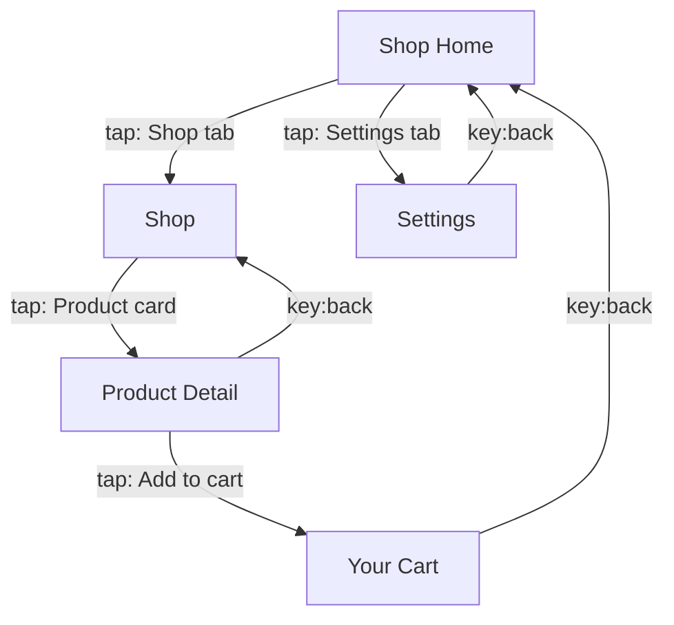

# App Explorer Report: com.example.shop

**Platform:** Android | **Date:** 2026-05-16

## Summary

| Metric | Value |
|--------|-------|
| Screens discovered | 5 |
| Transitions mapped | 7 |
| Interactive elements | 5 |
| Elements explored | 3 (60%) |

## Navigation Map

## Screen Inventory

### 1. Shop Home (`home`)

**Elements:**
- Shop tab (tab) -> `shop`
- Settings tab (tab) (unexplored)

---

### 2. Shop (`shop`)

**Elements:**
- Product card (list_item) -> `product`

---

### 3. Product Detail (`product`)

**Elements:**
- Add to cart (button) -> `cart`

---

### 4. Your Cart (`cart`)

**Elements:**
- Checkout (button) (unexplored)

**Notes:** Demo cart never persists

---

### 5. Settings (`settings`)

---

## User Paths

1. Shop Home -> Shop -> Product Detail -> Your Cart
2. Shop Home -> Settings

## Edge Cases

| Screen | Title | Notes |
|--------|-------|-------|
| `cart` | Your Cart | Demo cart never persists |
